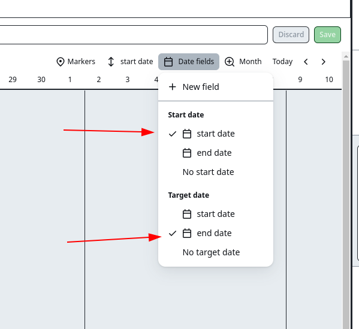
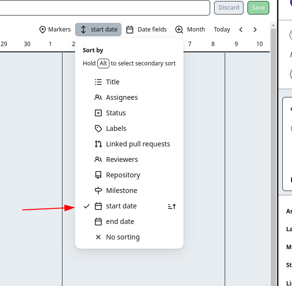

# semester-project-2
creater: [Eirik Berget Haukealnd](https://github.com/Eirik-Haukeland)

[See the project here!](https://eirik-haukeland.github.io/semester-project-2/)

## About the project
This is a front-end to an auction site using noroff's api. You may register a user with a
@stud.noroff.no or @noroff.no email address. as a user of this site you may vue and bid 
on, when a user registers they get 1000 credits to make bids. Users may also make your own.

## Design
the project was designed using figma. [The design files can be vued here](https://www.figma.com/file/ZyN39KVZJ76Ofgh3twhNtA/Untitled?type=design&node-id=23%3A2919&mode=design&t=PbwlknOjF974q5kF-1)
in the finished product there have been som variations form the original design. but it is mostly the same

[the inspiration and research can be found here](https://github.com/Eirik-Haukeland/semester-project-2/tree/main/design) 

## project management
[the gantchart can be seen here](https://github.com/users/Eirik-Haukeland/projects/4?pane=issue&itemId=36664826)
[and the kanban bord is awaiable here](https://github.com/users/Eirik-Haukeland/projects/4/views/2?pane=issue&itemId=36664826)

nb. when you open the gant chart it might appear empty. if so you need to select start and
end dates in the Date Fields menu and use sort by to get the ordering right

## technology

this project uses Github pages to host the page and is written with tailwind and post-css
it is configured to use prettier and es-lint 

